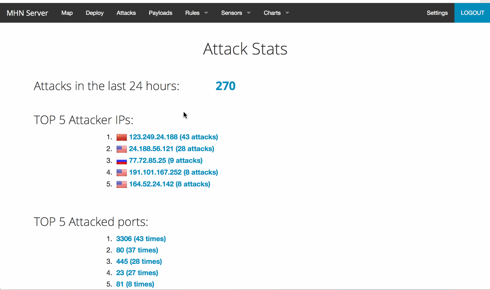

# week9
In this project, we had to create a honeypot server, is a computer system that is set up to act as a catch cyberattackers, and to detect, or study attempts to gain unauthorized access to information system.

## Which Honeypot(s) you deployed
- mhn-honeypot-1
- mhn-honeypot-2
- ubuntu-trusty-1

## Any issues you encountered
- There are lots of issues when I followed the instruction on the codepath, such as permmision deny and Could not fetch resource. I spent about 8 hours to set up because of the codepath issue. After I email the TA and they fix the bug. 

## A summary of the data collected: number of attacks, number of malware samples, etc.
- [x] Summary:
  - Deployed Honeypots
  - data collected
  - [x] GIF Walkthrough: 
  - ()

## Any unresolved questions raised by the data collected
 - No 
 
## Data
 - <a href=""> LOGS </a>
